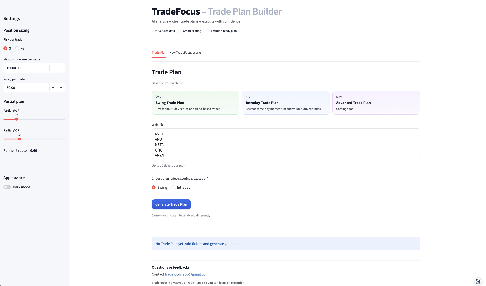

# TradeFocus

TradeFocus turns your watchlist into a clear, actionable trade plan using AI.

Supports both swing and intraday setups so you can focus on execution instead of guesswork.

## 🚀 Try it
https://tradefocus.streamlit.app/

## What it does
- Converts your watchlist into a structured Trade Plan
- Ranks setups by strength and priority
- Provides position sizing and risk/reward levels
- Helps avoid overtrading by focusing on the best setups

## Status
Actively being developed and improved based on user feedback.

---

If you have feedback, feel free to reach out.
